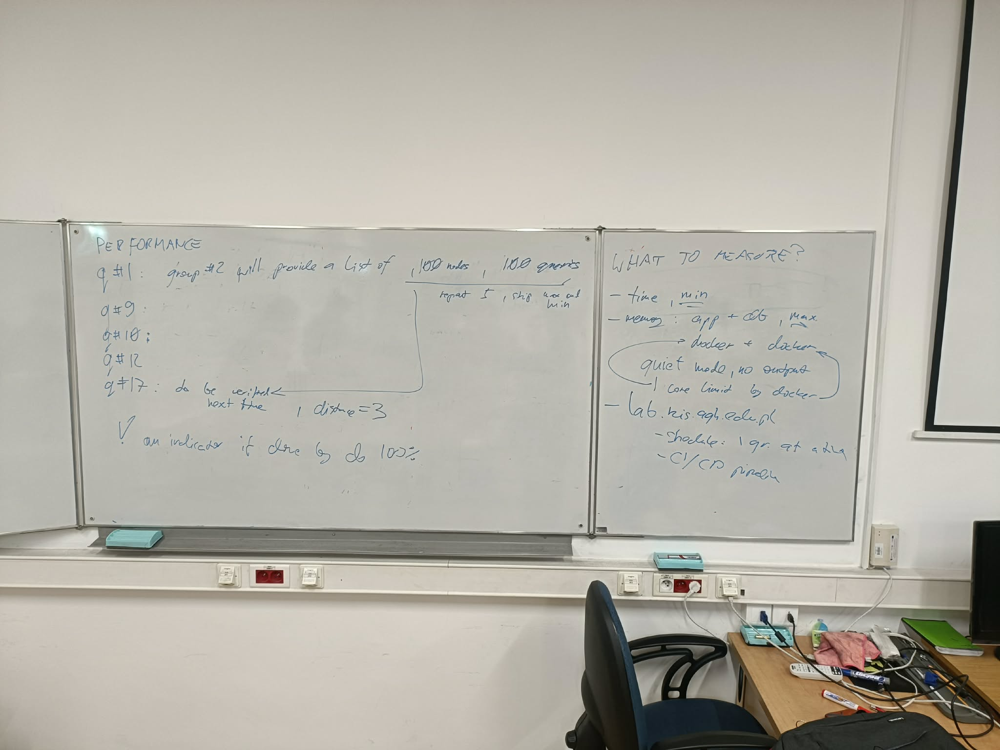
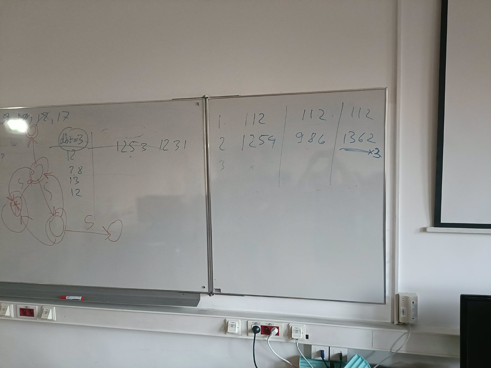
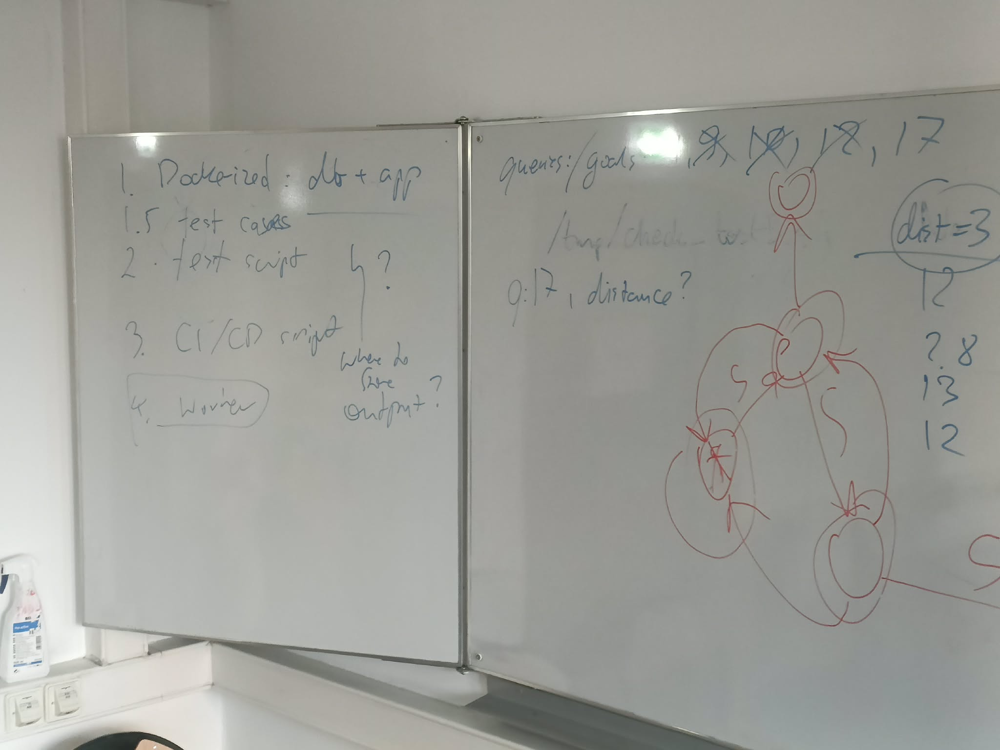

# Project ADB

## Database propositions

- dgraph,
- https://cayley.gitbook.io/cayley/

## Checklist

- [ ] Choice of technology.
- [ ] Architecture: components and interactions, optional diagram.
- [ ] Prerequisites (software modules, databases, etc.).
- [ ] Installation and setup instructions.
- [ ] Design and implementation process, step by step.
- [ ] Details on how each of the goals is addressed, including database queries and logic behind them.
- [ ] The roles of all the students in the project and description of who did what.
- [ ] Results, including example runs, outcomes and timings indicating efficiency.
- [ ] User manual (how to run the software) and a step-by-step manual how to reproduce the results.
- [ ] Self-evaluation: efficiency should be discussed, strategies for future mitigation of identified shortcomings.

## Data overview

* `id`: Row identifier.
* `node1`: Node 1 identifier.
* `relation`: Edge/relation type.
* `node2`: Node 2 identifier.
* `node1;label`: Human-readable label for node 1.
* `node2;label`: Human-readable label for node 2.
* `relation;label`: Human-readable label for the edge/relation.
* `relation;dimension`: Unused field.
* `source`: Record source.
* `sentence`: Sentence the term is used in.

There are 6001531 records.

## Questions

- How to handle incomplete records? Skip or rebuild somehow?


## Useful commands

- `curl -X POST localhost:8080/alter -d '{"drop_all": true}'` Remove all data

## Running the Dgraph stack

The original multi-service Dgraph setup now runs inside a single container that leverages Docker-in-Docker. Bring up the stack with:

```sh
docker compose up dgraph-stack
```

This starts a `docker:24-dind` container that, in turn, launches the original `docker-compose.dgraph.yml` (zero, alpha and ratel). The container exposes the same ports as before, so existing clients can still talk to `5080`, `6080`, `7080`, `8080`, `9080` and `8000`.

## Benchmark

Queries: 1,17

Requirements




