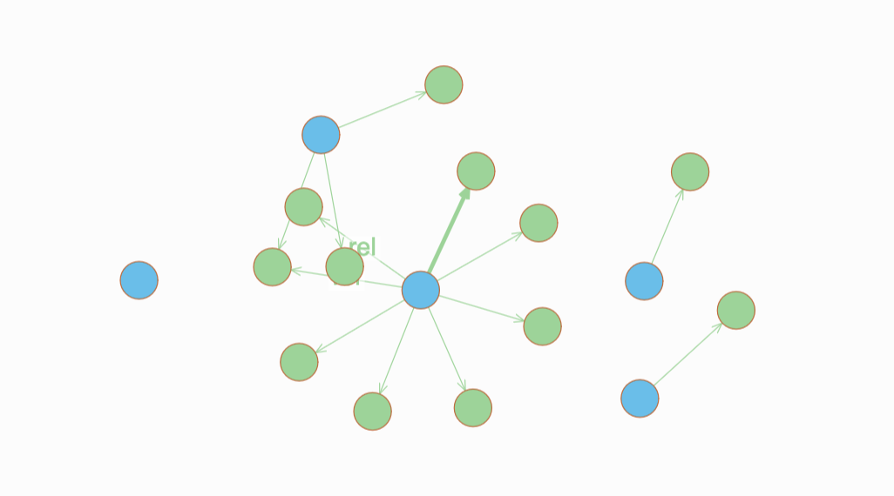

# Data ingestion report

## Data migration options

Dgraph supports a couple of data ingestion strategies.

### Live Import (Live Loader)

Designed for loading data into a loading cluster.

### Initial Import (Bulk Loader)

Only suitable when creating cluster from scratch, directly builds SS Tables of the database. Great parallelization configuration options. Suitable for substantial datasets.

### Import CSV Data

CSV, but not really. It is required to parse the CSV file into the JSON array, documentation suggests jq -- not suitable for big data volumes.

### Import MySQL Data

Import data from MySQL -> Dgraph.

## Problems

### Parsing TSV to RDFs

Dgraph's bulk load expects either JSON or RDF files, we decided to use RDF as it's more readable. RDF comes across as more space inefficient, undauntedly JSON line per row is more approachable in terms of space, yet processing JSON means more CPU ops, as it's structure is more demanding and expressive. In contrast, RDF remains simple structure of triples <object> <predicate> <subject>, already in form of a relation, this also makes data preparation on our side easier.

### Dynamic schema

> **TL;DR**
> Nice UI, terrible querying.

This option considers a dynamic schema generation -- each relation type is specified in schema (38k different predicates). This assumes schema such as:

```gql
uri: string @index(exact) .
label: string @index(exact) .
related_to: [uid] @reverse @count .
defined_as: [uid] @reverse @count .
synonym: [uid] @reverse @count .
...remaining thousands of predicates

type Concept {
    uri
    label
    related_to
    defined_as
    synonym
    ...remaining thousands of predicates
}
```

Since we can't know not we don't want to specify 38k values during schema modeling phase, this approach requires to generate it on the TSV -> RDF data parsing phase.

Generating dynamic schema gives the ability to visualize nicely the graphs, but this causes type Concept to explode with 38k relations, and query such as below takes much time to finalize, also 38k relations means 38k indices which sounds like a terrible idea.
  
```gql

{
  q(func: eq(label, "0")) {
    uid
    expand(_all_) {
      expand(_all_)
    }
  }
}
```

The following query yields visually approachable result, yet performance tradeoff is not acceptable.


## Decisions

### Use bulk loader

Live loader is extremely inefficient for CS dataset.

### Preprocess TSV

Parse TSV to RDF files.

### Remain simple schema structure

```gql
uri: string @index(exact) .
label: string @index(exact) .
rel: [uid] @reverse @count .

type Concept {
    uri
    label
    rel
}
```

This results in visualizations such as:

```gql

{
  q(func: eq(label, "0")) {
    uid
    expand(_all_) {
      expand(_all_)
    }
  }
}
```


